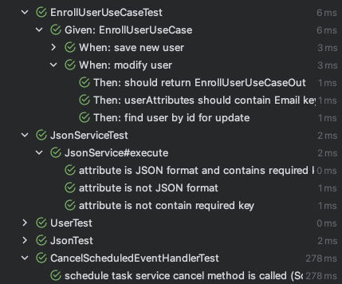

# CRM Project

## 임시 리드미

**!! 아래 스크립트는 루트 디렉토리를 기준으로 합니다 !!**

### 실행을 위한 로컬 개발 환경 설정

docker 및 docker-compose 설치가 필요합니다.

```bash
cd ./scripts && bash local-develop-env-reset
```

### 로컬 개발 환경 실행

```bash
# build
cd ./backend && ./gradlew bootJar && cd ..
```

```bash
# run
cd ./backend && java -jar ./build/libs/crm-0.0.1-SNAPSHOT.jar --spring.profiles.active=local,new
```

### API 문서

```bash
# API 문서 생성
cd ./backend && ./gradlew generateOpenApiDocs && cd ..
```

```bash
# API 문서 복사
cd ./backend && cp ./build/openapi.json ../docs/ && cd ..
```

### 테스트 실행

```bash
cd ./backend && ./gradlew test && cd ..
```



- 테스트 종류
  - UseCase Test
    - UseCase BDD 테스트
      - 요청에 따라 동작을 검증하는 테스트
  - Service 로직 테스트
    - 요청에 따른 Service 로직을 검증하는 테스트
  - Listener 테스트
    - 이벤트 발행 상황에 따라 Listener가 올바르게 동작하는지 검증하는 테스트
