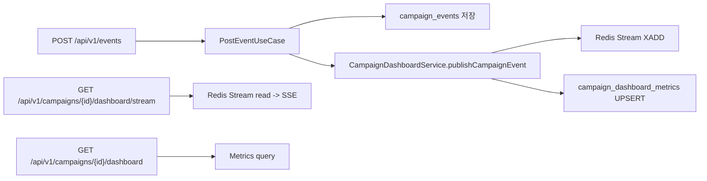

# Campaign Dashboard Implementation

## 문서 범위

이 문서는 `main` 브랜치에 반영된 Campaign Dashboard 구현 상태를 설명합니다.

- 기준일: 2026-02-25
- 대상 코드: `backend/src/main/kotlin/com/manage/crm/event/**`

## 개요

Campaign Dashboard는 이벤트 발생을 실시간 스트림으로 노출하고, 집계 메트릭을 조회하는 기능입니다.

핵심 기능

- Redis Stream 기반 이벤트 실시간 발행/구독
- SSE(Server-Sent Events) 스트리밍 API
- MySQL `campaign_dashboard_metrics` 집계 저장
- 캠페인 요약(전체/24시간/7일) 조회
- 스트림 상태(길이) 모니터링

## 현재 아키텍처

## 저장소

- 이벤트 스트림: Redis Stream (`campaign:dashboard:stream:{campaignId}`)
- 메트릭 저장: MySQL (`campaign_dashboard_metrics`)

주의

- 과거 문서에서 PostgreSQL로 표기된 부분은 현재 코드 기준으로 MySQL이 맞습니다.

## 메트릭 모델

테이블: `campaign_dashboard_metrics`

- `metric_type`: `EVENT_COUNT`, `UNIQUE_USER_COUNT`, `TOTAL_USER_COUNT`
- `time_window_unit`: `MINUTE`, `HOUR`, `DAY`, `WEEK`, `MONTH`
- unique key: `(campaign_id, metric_type, time_window_start, time_window_end)`

현재 구현 상태

- 자동 업데이트: `EVENT_COUNT` + `HOUR`, `DAY`
- 조회 파라미터: `MINUTE/HOUR/DAY/WEEK/MONTH` 모두 입력 가능
- `UNIQUE_USER_COUNT`, `TOTAL_USER_COUNT` 자동 집계는 아직 미구현

## API

- `GET /api/v1/campaigns/{campaignId}/dashboard`
- `GET /api/v1/campaigns/{campaignId}/dashboard/stream`
- `GET /api/v1/campaigns/{campaignId}/dashboard/summary`
- `GET /api/v1/campaigns/{campaignId}/dashboard/stream/status`

SSE 동작 요약

- 이벤트 타입: `campaign-event`, `error`, `stream-end`
- `lastEventId` 쿼리 또는 `Last-Event-ID` 헤더로 재연결 지원
- 기본 스트리밍 지속 시간: 3600초

## 운영 파라미터

- stream trim 기준: 길이가 100의 배수일 때 트리거
- trim 목표 길이: 10,000
- 데이터 생성 경로: `PostEventUseCase -> CampaignDashboardService`

## 제약 및 리스크

- 현재 집계는 이벤트 개수 중심이며, 사용자 기반 지표는 미완성
- 백필/재계산 전략은 API 수준 지원이 제한적
- 대용량 유입 시 upsert 경합/쓰기 부하 개선 여지 존재

## 다음 단계

- `#192`: UNIQUE/TOTAL 사용자 집계, 윈도우 확장, 백필 배치
- `#191`: 경합/병목 최적화, 처리량 개선
- `#197`: 운영 콘솔에서 대시보드 스트림 상태 시각화 강화
