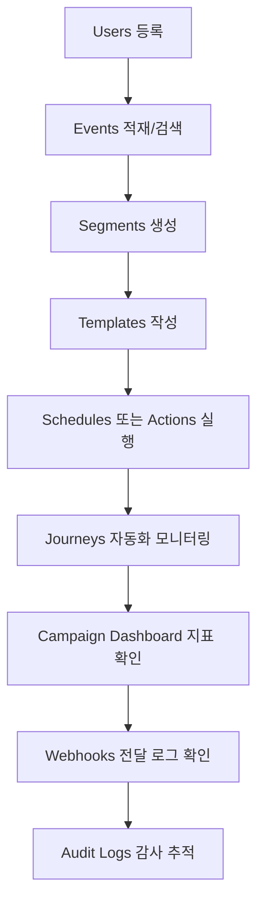

# CRM 운영 콘솔 상세 기능 명세

## 0. 문서 메타
- 문서명: CRM 운영 콘솔 상세 기능 명세
- 버전: v2.0 (상세화)
- 기준 브랜치: `main`
- 기준 코드/스펙 동기화일: 2026-02-26
- 대상 독자: 운영 담당자, 백엔드/프론트엔드 개발자, QA
- 작성 근거
  - 코드: `frontend/src/**`, `docs/openapi.json`
  - 기능 이슈/PR: `#185~#199`, `#214~#225`, `#227`, `#228`

## 1. 문서 목적
이 문서는 CRM 운영 콘솔의 화면별 기능을 "설명" 수준이 아니라 "운영 명세" 수준으로 정의합니다.

포함 범위
- 화면 목적, 입력 규칙, 사용 절차, API 계약, 실패 시 대응
- 운영자가 실제로 수행하는 end-to-end 시나리오
- 문서/코드/이슈 추적 포인트

비포함 범위
- 백엔드 내부 구현 상세(클래스 수준 알고리즘)
- 인프라 배포/네트워크 구성 상세

## 2. 콘솔 정보 구조(IA)

| 상위 영역 | 메뉴 | 목적 |
| --- | --- | --- |
| 개요 | Overview | 전체 운영 상태 요약 |
| 개요 | Campaign Dashboard | 캠페인 집계 + 실시간 이벤트 스트림 |
| 개요 | Audit Logs | 운영 감사 로그 조회 |
| 개요 | Feature Guide | 기능 문서 정적 페이지 |
| 고객 관리 | Users | 고객 등록/조회 |
| 고객 관리 | Events | 이벤트 생성/검색 |
| 고객 관리 | Segments | 조건 기반 타겟 그룹 관리 |
| 고객 관리 | Journeys | 자동화 여정 생성/실행 이력 조회 |
| 고객 관리 | Actions | 멀티채널 즉시 발송 |
| 메시지 운영 | Templates | 이메일 템플릿 관리 |
| 메시지 운영 | Histories | 이메일 발송 이력 조회 |
| 메시지 운영 | Schedules | 이메일 예약/취소 |
| 연동 | Webhooks | 외부 전달 엔드포인트 + 전달 로그 |

관련 파일
- 앱 셸/탭 전환: `frontend/src/App.tsx`
- 정적 가이드 페이지: `frontend/src/page/feature-guide/FeatureGuidePage.tsx`
- 상세 문서 원본: `docs/CONSOLE_FEATURE_GUIDE.md`

## 3. 사전 준비

### 3.1 백엔드 연결
프론트엔드 API Base URL 우선순위
1. `REACT_APP_API_BASE_URL`
2. `production`: `/api/v1`
3. 기본: `http://localhost:8080/api/v1`

### 3.2 권장 초기 데이터
빠른 기능 검증을 위해 seed 데이터 주입 권장

```bash
bash scripts/test-data/seed-all.sh
```

참고: `scripts/test-data/README.md` (PR `#228`)

### 3.3 Webhook 기능 토글
Webhook 동작 여부는 백엔드 설정 `webhook.enabled`에 의존합니다.

## 4. 공통 운영 규칙

### 4.1 Idempotency-Key 표준
다음 쓰기 API는 프론트에서 `Idempotency-Key`를 자동 생성해 헤더로 전달합니다.

- `POST /users`
- `POST /events`
- `POST /events/campaign`
- `POST /emails/send/notifications`
- `POST /emails/schedules/notifications/email`
- `POST /webhooks`
- `PUT /webhooks/{id}`
- `POST /segments`
- `PUT /segments/{id}`
- `POST /journeys`
- `POST /actions/dispatch`

근거: Issue `#196`, PR `#215`

### 4.2 시간/날짜
- UI 렌더링: 브라우저 로컬 타임존
- 입력 포맷: `datetime-local` (`YYYY-MM-DDTHH:mm`)
- Campaign Dashboard는 서버 파라미터 전송 시 초(`:00`)를 보정할 수 있음

### 4.3 에러 처리 기본
- API 에러는 각 화면 상단/폼 인라인 메시지로 노출
- JSON 입력 필드(segments/journeys/actions)는 프론트에서 먼저 파싱 검증
- 숫자 ID 필드는 양수 검증을 우선 수행

### 4.4 조회 기본
- 대부분 화면은 진입 시 자동 조회
- 결과 없음과 조회 실패는 분리 표시하도록 구현

## 5. 운영 핵심 플로우



## 6. 화면별 상세 명세

## 6.1 Overview

### 목적
운영 상태를 카드 + 최근 이력으로 빠르게 스캔합니다.

### 화면 구성
| 영역 | 설명 | 데이터 소스 |
| --- | --- | --- |
| KPI 카드 | 총 사용자, 템플릿, 스케줄, 이력, 웹훅, 세그먼트, 여정, 실행, 액션, 감사로그 수치 | 각 도메인 조회 API |
| Recent Users | 최근 사용자 8건 | `GET /users` |
| Recent Action Dispatches | 최근 액션 전송 8건 | `GET /actions/dispatch/histories` |

### 연동 API
- `GET /users`
- `GET /users/count`
- `GET /emails/templates`
- `GET /emails/histories`
- `GET /emails/schedules/notifications/email`
- `GET /webhooks`
- `GET /segments`
- `GET /journeys`
- `GET /journeys/executions`
- `GET /actions/dispatch/histories`
- `GET /audit-logs`

### 운영 팁
- "카드 급감"은 데이터 파이프라인/권한/필터 조건 변경 가능성을 우선 점검
- 상세 원인은 해당 도메인 페이지에서 재조회로 확정

## 6.2 Campaign Dashboard

### 목적
캠페인별 성과 지표와 실시간 유입 이벤트를 동시에 모니터링합니다.

### 입력 스펙
| 필드 | 타입 | 필수 | 규칙 | 예시 |
| --- | --- | --- | --- | --- |
| Campaign ID | number | Y | 양수 정수 | `1` |
| Time Window | enum | N | `MINUTE/HOUR/DAY/WEEK/MONTH` | `HOUR` |
| Start Time | datetime-local | N | 비어 있으면 전체 범위 | `2026-02-26T09:00` |
| End Time | datetime-local | N | 비어 있으면 현재 기준 | `2026-02-26T18:00` |
| SSE Duration | number | N | 양수, 기본 3600 | `3600` |

### 사용 절차
1. Campaign ID 입력
2. `Refresh`로 집계 + 스트림 상태 조회
3. 필요 시 기간 필터 조정 후 재조회
4. `Connect`로 SSE 연결
5. 장애/정리 시 `Disconnect`, `Clear Events`

### API 계약
#### Dashboard 조회
```http
GET /api/v1/campaigns/{campaignId}/dashboard?startTime=2026-02-26T09:00:00&endTime=2026-02-26T18:00:00&timeWindowUnit=HOUR
```

주요 응답 필드
- `campaignId`
- `metrics[]`
  - `metricType`
  - `metricValue`
  - `timeWindowStart`
  - `timeWindowEnd`
  - `timeWindowUnit`
- `summary`
  - `totalEvents`
  - `eventsLast24Hours`
  - `eventsLast7Days`
  - `lastUpdated`

#### Stream 상태 조회
```http
GET /api/v1/campaigns/{campaignId}/dashboard/stream/status
```

주요 응답 필드
- `streamLength`
- `checkedAt`

#### SSE 연결
```http
GET /api/v1/campaigns/{campaignId}/dashboard/stream?durationSeconds=3600
```

이벤트 타입
- `campaign-event`
- `stream-end`
- `error`

### 실패 시 점검
- `No metrics found`: 캠페인 ID 오입력 또는 해당 구간 이벤트 부재
- 연결 상태가 `reconnecting` 지속: 네트워크/서버 SSE 경로 점검
- streamLength 증가 없음: 이벤트 적재 경로(`POST /events`) 확인

근거: Issue `#197`, `#192`, PR `#214`, `#216`, `#217`

## 6.3 Webhooks

### 목적
외부 전송 대상 등록/수정/삭제와 전달 성공/실패 이력을 운영합니다.

### 입력 스펙
| 필드 | 타입 | 필수 | 규칙 | 예시 |
| --- | --- | --- | --- | --- |
| Name | string | Y | 공백 불가 | `order-events-webhook` |
| URL | url | Y | `http://` 또는 `https://` | `https://example.com/webhooks/events` |
| Events | comma-separated string | Y | 최소 1개 이벤트 | `EVENT_CREATED,EMAIL_SENT` |
| Active | boolean | N | 기본 `true` | `true` |

### 사용 절차
1. `New Webhook` 클릭
2. Name/URL/Events/Active 입력 후 생성
3. 필요 시 Edit로 수정
4. 대상 행의 `Logs` 클릭 후 Delivery/DLQ 확인
5. 불필요 시 Delete

### API 계약
#### 생성
```http
POST /api/v1/webhooks
Idempotency-Key: webhook-create-xxxx
Content-Type: application/json

{
  "name": "order-events-webhook",
  "url": "https://example.com/webhooks/events",
  "events": ["EVENT_CREATED", "EMAIL_SENT"],
  "active": true
}
```

#### 수정
```http
PUT /api/v1/webhooks/{id}
Idempotency-Key: webhook-update-<id>-xxxx
```

#### 목록/상세
- `GET /api/v1/webhooks`
- `GET /api/v1/webhooks/{id}`

#### 전달 로그
- `GET /api/v1/webhooks/{id}/deliveries?limit=50`
- 주요 필드: `deliveryStatus`, `attemptCount`, `responseStatus`, `errorMessage`, `deliveredAt`

#### Dead Letters
- `GET /api/v1/webhooks/{id}/dead-letters?limit=50`
- 주요 필드: `payloadJson`, `deliveryStatus`, `attemptCount`, `errorMessage`, `createdAt`

### 실패 시 점검
- URL 형식 오류: 스킴(`http/https`) 누락 여부 확인
- 전달 실패 증가: 대상 서버 응답코드/서명/HMAC 정책 점검
- DLQ 누적: 재시도 정책/Rate Limit/Circuit Breaker 영향 확인

근거: Issue `#189`, `#190`, PR `#219`, `#220`, `#221`

## 6.4 Users

### 목적
운영 대상 고객을 externalId + attributes로 등록/조회합니다.

### 입력 스펙
| 필드 | 타입 | 필수 | 규칙 | 예시 |
| --- | --- | --- | --- | --- |
| External ID | string | Y | 고객 식별 고유값 | `user-1001` |
| User Attributes | string(JSON) | Y | JSON 문자열 권장 | `{"country":"KR","grade":"VIP"}` |

### 사용 절차
1. `Enroll User` 클릭
2. External ID, User Attributes 입력
3. Enroll 실행
4. 검색창으로 `externalId`/`attributes` 텍스트 조회

### API 계약
#### 목록
```http
GET /api/v1/users?page=0&size=20&query=
```

응답 구조
- `users.content[]`
- `users.page`
- `users.size`
- `users.totalElements`
- `users.totalPages`

#### 등록
```http
POST /api/v1/users
Idempotency-Key: user-enroll-xxxx
Content-Type: application/json

{
  "externalId": "user-1001",
  "userAttributes": "{\"country\":\"KR\",\"grade\":\"VIP\"}"
}
```

#### 사용자 수
```http
GET /api/v1/users/count
```

### 실패 시 점검
- 중복/동시성 문제: 동일 externalId 다중 요청 여부 확인
- attributes 검색 결과 불일치: JSON key naming 일관성 점검

## 6.5 Events

### 목적
이벤트를 적재하고 where DSL로 이벤트를 조회합니다.

### 입력 스펙
#### 검색
| 필드 | 필수 | 규칙 | 예시 |
| --- | --- | --- | --- |
| Event Name | Y | 공백 불가 | `view_product` |
| Where | Y | DSL 문자열 | `category&electronics&=&end` |

#### 생성
| 필드 | 필수 | 규칙 |
| --- | --- | --- |
| name | Y | 공백 불가 |
| externalId | Y | 공백 불가 |
| campaignName | N | 캠페인 연계 시 입력 |
| properties | N | key/value 배열 |
| segmentId | N | 양수 정수 |

### where DSL 운영 가이드
- 토큰 형식: `field&value&operator&join`
- join: `and`, `or`, `end`
- 연산자: `=`, `!=`, `>`, `>=`, `<`, `<=`, `like`, `between`

예시
- 단일: `category&electronics&=&end`
- 다중 AND: `category&electronics&=&and,brand&samsung&=&end`
- 범위: `amount&100&amount&200&between&end`

### API 계약
#### 검색
```http
GET /api/v1/events?eventName=view_product&where=category%26electronics%26%3D%26end
```

#### 생성
```http
POST /api/v1/events
Idempotency-Key: event-create-xxxx
Content-Type: application/json

{
  "name": "view_product",
  "campaignName": "spring_sale",
  "externalId": "user-1001",
  "segmentId": 1,
  "properties": [
    { "key": "category", "value": "electronics" },
    { "key": "amount", "value": "120000" }
  ]
}
```

### 실패 시 점검
- `eventName은 필수입니다.`: 공백 입력 확인
- `where는 필수입니다.`: DSL 누락 확인
- 결과 0건: DSL 연산자/조인 토큰 오타 확인

근거: Issue `#194`, `#191`, PR `#218`

## 6.6 Email Templates

### 목적
재사용 가능한 메일 템플릿(본문/변수/버전)을 운영합니다.

### 입력 스펙
| 필드 | 필수 | 규칙 | 예시 |
| --- | --- | --- | --- |
| templateName | Y | 공백 불가 | `welcome_mail` |
| body | Y | 공백 불가 | `안녕하세요 {{user.name}}` |
| subject | N | 제목 | `환영합니다` |
| variables | N | 쉼표 구분 | `user.name,campaign.eventCount` |
| version | N | 기본 1.0 | `1.0` |

### API 계약
#### 목록
```http
GET /api/v1/emails/templates?history=false
```

#### 생성
```http
POST /api/v1/emails/templates
Content-Type: application/json

{
  "templateName": "welcome_mail",
  "subject": "환영합니다",
  "body": "안녕하세요 {{user.name}}",
  "variables": ["user.name", "campaign.eventCount"],
  "version": 1.0
}
```

#### 삭제
```http
DELETE /api/v1/emails/templates/{templateId}?force=false
```

### 실패 시 점검
- 생성 실패: 필수 필드(`templateName`, `body`) 확인
- 변수 치환 실패: 변수 문법/해석 source 점검

근거: Issue `#199`, PR `#202`

## 6.7 Email Histories

### 목적
발송 결과 이력을 조건별로 조회합니다.

### 입력 스펙
| 필드 | 필수 | 규칙 |
| --- | --- | --- |
| userId | N | 양수 정수 |
| sendStatus | N | 상태 문자열 |
| page | N | 0 이상 |
| size | N | 1 이상 |

### API 계약
```http
GET /api/v1/emails/histories?userId=1001&sendStatus=SUCCESS&page=0&size=20
```

주요 응답 필드
- `histories[]`
  - `userEmail`
  - `sendStatus`
  - `emailMessageId`
  - `createdAt`
- `totalCount`, `page`, `size`

### 실패 시 점검
- totalCount가 예상보다 낮은 경우: page/size 확인
- 상태 필터 무효: 서버에서 사용하는 상태 값 확인

## 6.8 Email Schedules

### 목적
만료시각 기반 예약 발송 작업을 생성/취소합니다.

### 입력 스펙
| 필드 | 필수 | 규칙 | 예시 |
| --- | --- | --- | --- |
| templateId | Y | 양수 정수 | `1` |
| userIds | N | 숫자 배열 | `[1001,1002]` |
| segmentId | N | 양수 정수 | `3` |
| expiredTime | Y | ISO datetime | `2026-02-27T09:00:00` |

주의
- OpenAPI 기준 필수는 `templateId`, `expiredTime`입니다.
- 타겟은 `userIds` 또는 `segmentId`를 운영 정책에 맞게 지정합니다.

### API 계약
#### 목록
```http
GET /api/v1/emails/schedules/notifications/email
```

#### 생성
```http
POST /api/v1/emails/schedules/notifications/email
Idempotency-Key: email-schedule-create-xxxx
Content-Type: application/json

{
  "templateId": 1,
  "userIds": [1001, 1002],
  "segmentId": 3,
  "expiredTime": "2026-02-27T09:00:00"
}
```

#### 취소
```http
DELETE /api/v1/emails/schedules/notifications/email/{scheduleId}
```

### 실패 시 점검
- 생성 실패: 만료시각 포맷/타겟 지정 확인
- 취소 실패: scheduleId 인코딩 문제 또는 이미 종료된 작업 여부 확인

## 6.9 Segments

### 목적
조건식 기반 고객 그룹(세그먼트)을 생성/수정/삭제합니다.

### 입력 스펙
| 필드 | 필수 | 규칙 |
| --- | --- | --- |
| name | Y | 공백 불가 |
| description | N | 설명 텍스트 |
| active | N | 기본 true |
| conditions | Y | 배열, 최소 1개 |

`conditions[]` 객체 필수 필드
- `field`
- `operator`
- `valueType`
- `value`

예시
```json
[
  {
    "field": "country",
    "operator": "eq",
    "valueType": "STRING",
    "value": "KR"
  }
]
```

### 사용 절차
1. 새 세그먼트에서 이름/조건 JSON 입력
2. 생성 후 목록에서 ACTIVE 상태 확인
3. Edit로 조건 조정
4. 필요 시 Delete

### API 계약
#### 생성
```http
POST /api/v1/segments
Idempotency-Key: segment-create-xxxx
Content-Type: application/json

{
  "name": "KR users",
  "description": "국내 사용자",
  "active": true,
  "conditions": [
    { "field": "country", "operator": "eq", "valueType": "STRING", "value": "KR" }
  ]
}
```

#### 수정
```http
PUT /api/v1/segments/{id}
Idempotency-Key: segment-update-{id}-xxxx
```

#### 조회/삭제
- `GET /api/v1/segments?limit=50`
- `GET /api/v1/segments/{id}`
- `DELETE /api/v1/segments/{id}`

### 실패 시 점검
- 조건 JSON 파싱 실패: 쉼표/따옴표/배열 구조 확인
- 생성 실패: 빈 조건 또는 필수 키 누락 확인

근거: Issue `#188`, PR `#222`

## 6.10 Journeys

### 목적
트리거 기반 자동화 플로우를 만들고 실행 상태를 모니터링합니다.

### 입력 스펙
#### Journey 생성
| 필드 | 필수 | 규칙 |
| --- | --- | --- |
| name | Y | 공백 불가 |
| triggerType | Y | 문자열 |
| steps | Y | 배열, 최소 1개 |
| triggerEventName | N | 이벤트 트리거명 |
| triggerSegmentId | N | 양수 정수 |
| active | N | 기본 true |

`steps[]` 필수
- `stepOrder`: 정수, 최소 1
- `stepType`: 공백 불가 문자열

선택 필드
- `channel`, `destination`, `subject`, `body`, `variables`
- `delayMillis`
- `conditionExpression`
- `retryCount`(0 이상)

### 사용 절차
1. 새 여정에서 Trigger/Steps JSON 작성
2. 생성 후 Journey List 확인
3. Execution List에서 상태 추적
4. History 버튼으로 단계별 이력 조회

### API 계약
#### 생성
```http
POST /api/v1/journeys
Idempotency-Key: journey-create-xxxx
Content-Type: application/json

{
  "name": "Welcome Journey",
  "triggerType": "EVENT",
  "triggerEventName": "USER_SIGNUP",
  "active": true,
  "steps": [
    {
      "stepOrder": 1,
      "stepType": "ACTION",
      "channel": "EMAIL",
      "destination": "user@example.com",
      "subject": "Welcome",
      "body": "welcome-message",
      "retryCount": 1
    }
  ]
}
```

#### 조회
- `GET /api/v1/journeys`
- `GET /api/v1/journeys/executions?journeyId=&eventId=&userId=`
- `GET /api/v1/journeys/executions/{executionId}/histories`

### 실패 시 점검
- 실행 미발생: triggerType/triggerEventName 매칭 여부
- step JSON 오류: `stepOrder`, `stepType` 필수 충족 여부
- 중복 실행 의심: execution history의 idempotency key 확인

근거: Issue `#187`, PR `#225`

## 6.11 Actions

### 목적
이메일/슬랙/디스코드 채널로 즉시 메시지를 발송합니다.

### 입력 스펙
| 필드 | 필수 | 규칙 |
| --- | --- | --- |
| channel | Y | 문자열 (`EMAIL`, `SLACK`, `DISCORD` UI 제공) |
| destination | Y | 길이 제한(최대 1024) |
| body | Y | 메시지 본문 |
| subject | N | 제목(최대 255) |
| variables | N | JSON object |
| campaignId | N | 양수 정수 |
| journeyExecutionId | N | 양수 정수 |

### 사용 절차
1. 채널/목적지/본문 입력
2. 필요 시 변수 JSON/연계 ID 입력
3. Dispatch 실행
4. 하단 Histories에서 결과 확인

### API 계약
```http
POST /api/v1/actions/dispatch
Idempotency-Key: action-dispatch-xxxx
Content-Type: application/json

{
  "channel": "EMAIL",
  "destination": "user@example.com",
  "subject": "긴급 공지",
  "body": "안녕하세요 {{name}}",
  "variables": {
    "name": "홍길동"
  },
  "campaignId": 1,
  "journeyExecutionId": 101
}
```

조회
```http
GET /api/v1/actions/dispatch/histories?campaignId=1&journeyExecutionId=101
```

### 실패 시 점검
- variables 파싱 실패: JSON object 여부 확인
- 채널 실패 증가: provider 메시지(`errorCode`, `errorMessage`) 확인

근거: Issue `#185`, PR `#224`

## 6.12 Audit Logs

### 목적
운영 변경 이벤트를 감사 목적으로 조회합니다.

### 입력 스펙
| 필드 | 필수 | 규칙 |
| --- | --- | --- |
| limit | N | 양수 |
| action | N | 액션 문자열 |
| resourceType | N | 리소스 타입 |
| actorId | N | 사용자/토큰 식별자 |

### API 계약
```http
GET /api/v1/audit-logs?limit=50&action=CREATE_WEBHOOK&resourceType=WEBHOOK&actorId=admin@acme.com
```

주요 응답 필드
- `action`
- `resourceType`
- `actorId`
- `requestMethod`
- `requestPath`
- `statusCode`
- `createdAt`

### 실패 시 점검
- 결과 없음: limit/action/resourceType 조건 과도 여부 확인
- 상태 코드 급증: 같은 시각의 webhook/actions/journeys 변경 이력과 교차 분석

근거: Issue `#190`, PR `#221`

## 7. 운영 시나리오(runbook)

## 7.1 신규 캠페인 런칭
1. Users 등록 상태 확인 (`/users`)
2. Events로 샘플 이벤트 적재 (`/events`)
3. Segments 생성 (`/segments`)
4. Templates 생성 (`/emails/templates`)
5. 필요 시 Actions로 즉시 발송 테스트 (`/actions/dispatch`)
6. Journeys 생성 후 실행 관찰 (`/journeys`, `/journeys/executions`)
7. Campaign Dashboard에서 집계/실시간 스트림 확인
8. Webhooks 전달 로그/DLQ 확인
9. Audit Logs 최종 감사 확인

## 7.2 장애 대응(예: 전달 실패 급증)
1. Webhooks Delivery/Dead Letter 확인
2. Actions Histories에서 채널별 에러 코드 확인
3. Audit Logs로 해당 시점 변경 작업 추적
4. Campaign Dashboard로 이벤트 유입 정상 여부 확인
5. 필요 시 대상 webhook 비활성화 후 단계적 복구

## 8. API 요약 매트릭스

| 기능 | API | 쓰기/읽기 | Idempotency-Key |
| --- | --- | --- | --- |
| 사용자 등록 | `POST /users` | 쓰기 | 필요 |
| 사용자 조회 | `GET /users` | 읽기 | 불필요 |
| 이벤트 생성 | `POST /events` | 쓰기 | 필요 |
| 이벤트 검색 | `GET /events` | 읽기 | 불필요 |
| 캠페인 생성 | `POST /events/campaign` | 쓰기 | 필요 |
| 템플릿 생성 | `POST /emails/templates` | 쓰기 | 불필요 |
| 예약 생성 | `POST /emails/schedules/notifications/email` | 쓰기 | 필요 |
| 예약 취소 | `DELETE /emails/schedules/notifications/email/{scheduleId}` | 쓰기 | 불필요 |
| 웹훅 생성/수정 | `POST/PUT /webhooks` | 쓰기 | 필요 |
| 세그먼트 생성/수정 | `POST/PUT /segments` | 쓰기 | 필요 |
| 여정 생성 | `POST /journeys` | 쓰기 | 필요 |
| 액션 발송 | `POST /actions/dispatch` | 쓰기 | 필요 |
| 감사로그 조회 | `GET /audit-logs` | 읽기 | 불필요 |

## 9. 알려진 제약 및 향후 항목

### 현재 제약
- 개인정보 보존/삭제 정책(`Retention/Masking/Right-to-delete`)은 미완료
- 조건 DSL의 정확도는 입력 포맷 품질에 민감
- 대시보드/실시간 화면은 운영 데이터 품질에 직접 영향

### 추적 이슈
- Open: `#198` 개인정보 정책
- Closed but roadmap-related: `#192`, `#191`, `#189`

## 10. 변경 이력
- 2026-02-26: 초기 운영 가이드 작성 (v1)
- 2026-02-26: 화면별 입력/절차/API 예시/장애 대응 포함 상세화 (v2)
