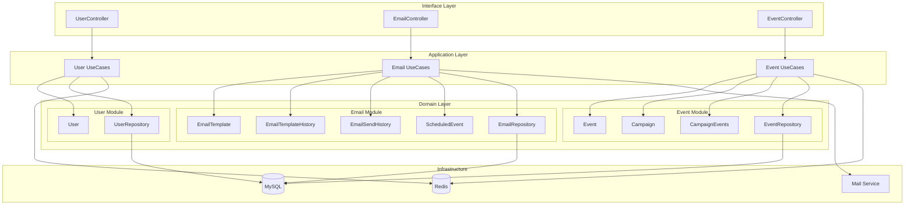
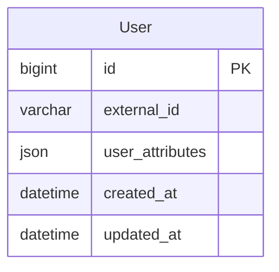
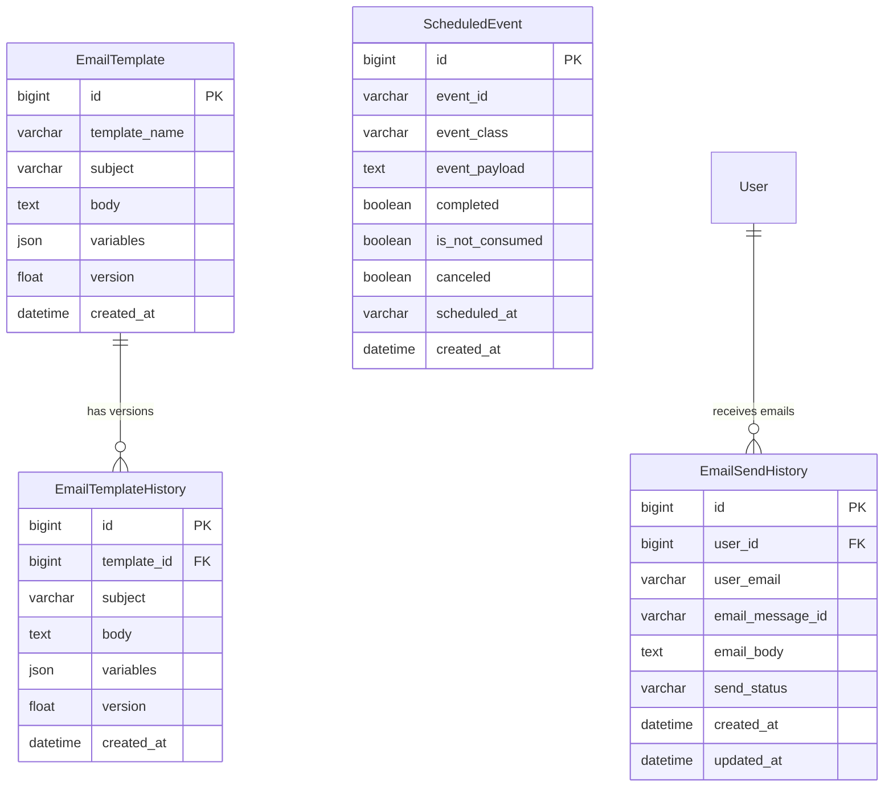
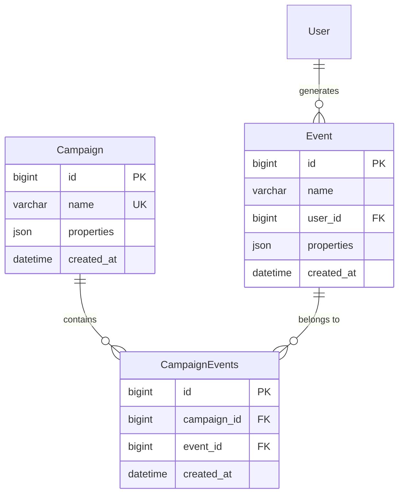
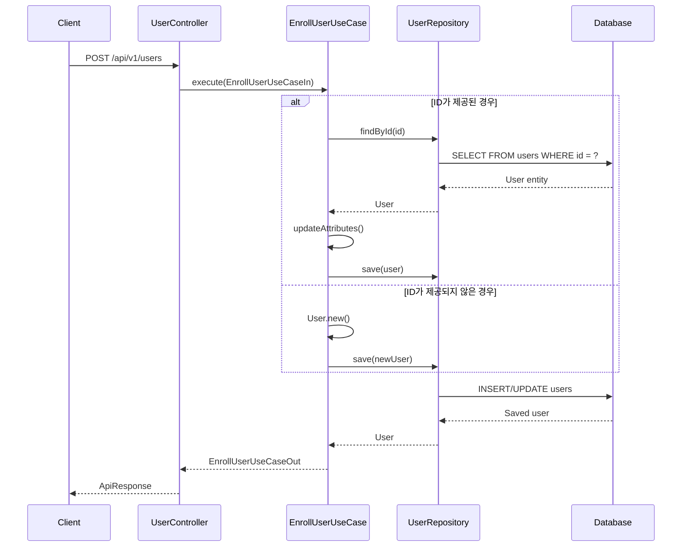
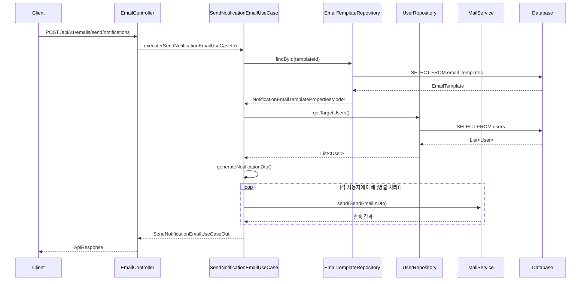
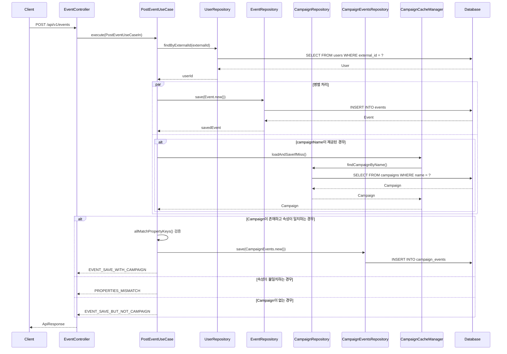
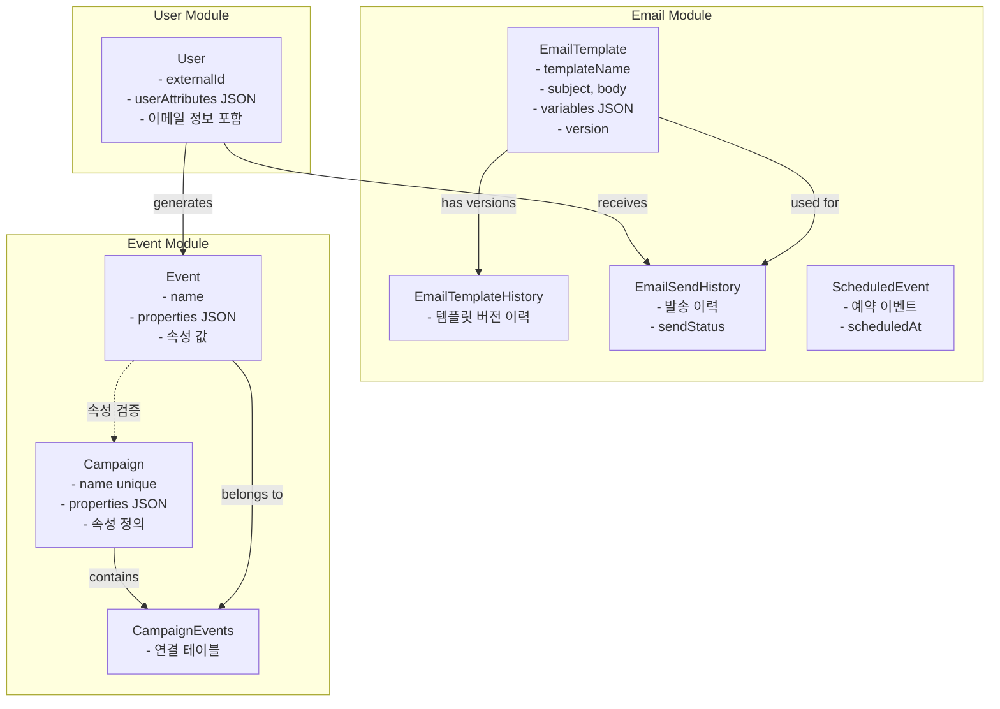
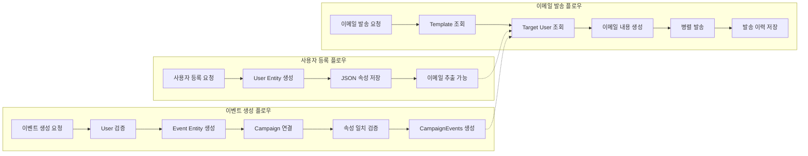

# Domain and UseCase Flows Documentation

## 개요

이 문서는 CRM 시스템의 Domain Entity와 UseCase의 플로우를 정리한 문서입니다. 

CRM 시스템은 **User**, **Email**, **Event** 세 가지 주요 모듈로 구성되며, Clean Architecture와 Domain-Driven Design (DDD) 원칙을 따라 설계되었습니다.

## 아키텍처 개요

## Domain Entities

### User Module

#### User Entity
- **테이블**: `users`
- **주요 속성**:
  - `id`: 사용자 ID (PK)
  - `externalId`: 외부 시스템 연동용 ID
  - `userAttributes`: JSON 형태의 사용자 속성 (이메일, 기타 정보)
  - `createdAt`, `updatedAt`: 생성/수정 시간

### Email Module

#### EmailTemplate Entity
- **테이블**: `email_templates`
- **주요 속성**:
  - `id`: 템플릿 ID (PK)
  - `templateName`: 템플릿 이름
  - `subject`: 이메일 제목
  - `body`: 이메일 본문 (HTML)
  - `variables`: 템플릿 변수 정의
  - `version`: 템플릿 버전

#### EmailTemplateHistory Entity
- **테이블**: `email_template_histories`
- **용도**: 템플릿 버전 관리

#### EmailSendHistory Entity
- **테이블**: `email_send_histories`
- **주요 속성**:
  - `userId`: 수신자 사용자 ID
  - `userEmail`: 수신자 이메일
  - `sendStatus`: 발송 상태
  - `emailBody`: 발송된 이메일 본문

#### ScheduledEvent Entity
- **테이블**: `scheduled_events`
- **주요 속성**:
  - `eventId`: 스케줄 이벤트 ID
  - `eventClass`: 이벤트 클래스명
  - `completed`: 완료 여부
  - `canceled`: 취소 여부
  - `scheduledAt`: 스케줄 시간

### Event Module

#### Campaign Entity
- **테이블**: `campaigns`
- **주요 속성**:
  - `id`: 캠페인 ID (PK)
  - `name`: 캠페인 이름 (고유)
  - `properties`: 캠페인 속성 정의 (JSON)

#### Event Entity
- **테이블**: `events`
- **주요 속성**:
  - `id`: 이벤트 ID (PK)
  - `name`: 이벤트 이름
  - `userId`: 사용자 ID
  - `properties`: 이벤트 속성 (JSON)

#### CampaignEvents Entity
- **테이블**: `campaign_events`
- **용도**: Campaign과 Event 간의 다대다 관계 매핑

## UseCase 플로우

### User Module UseCases

#### 1. EnrollUserUseCase
사용자를 등록하거나 업데이트합니다.

#### 2. BrowseUserUseCase
전체 사용자 목록을 조회합니다.

#### 3. GetTotalUserCountUseCase
총 사용자 수를 조회합니다.

### Email Module UseCases

#### 1. SendNotificationEmailUseCase
사용자들에게 알림 이메일을 발송합니다.

#### 2. PostTemplateUseCase
이메일 템플릿을 생성하거나 수정합니다.

#### 3. PostEmailNotificationSchedulesUseCase
이메일 알림을 스케줄링합니다.

#### 4. CancelNotificationEmailUseCase
스케줄된 이메일 알림을 취소합니다.

### Event Module UseCases

#### 1. PostEventUseCase
이벤트를 생성하고 캠페인과 연결합니다.

#### 2. PostCampaignUseCase
캠페인을 생성합니다.

#### 3. SearchEventsUseCase
이벤트를 검색합니다.

## 주요 특징

### 1. 반응형 프로그래밍
- **Spring WebFlux** 사용으로 모든 데이터베이스 작업이 비동기(`suspend` functions)
- **R2DBC**를 통한 반응형 데이터베이스 접근

### 2. JSON 저장 패턴
- **User.userAttributes**: 사용자의 동적 속성 저장 (이메일 등)
- **Campaign.properties**: 캠페인의 속성 정의
- **Event.properties**: 이벤트의 속성 값
- **EmailTemplate.variables**: 템플릿 변수 정의

### 3. 캐싱 전략
- **Redis**를 통한 분산 캐싱
- **CampaignCacheManager**: 캠페인 정보 캐싱
- **UserCacheManager**: 사용자 정보 캐싱

### 4. 이벤트 기반 아키텍처
- **Domain Events**: 모듈 간 느슨한 결합
- **PostEmailTemplateEvent**: 템플릿 수정 시 발생
- 비동기 이벤트 처리

### 5. 이메일 시스템
- **다중 프로바이더 지원**: AWS SES, JavaMail
- **템플릿 버전 관리**: EmailTemplateHistory를 통한 버전 관리
- **스케줄링**: ScheduledEvent를 통한 예약 발송
- **병렬 처리**: 대용량 이메일 발송 시 병렬 처리 (concurrency = 10)

### 6. 캠페인-이벤트 연동
- 이벤트 생성 시 캠페인과 자동 연결
- 속성 키 검증을 통한 데이터 일관성 보장
- 캐싱을 통한 성능 최적화

## Entity 간의 관계도

## 데이터 플로우

이 문서는 CRM 시스템의 현재 구현 상태를 반영하여 작성되었으며, 코드 변경 시 자동으로 업데이트됩니다.