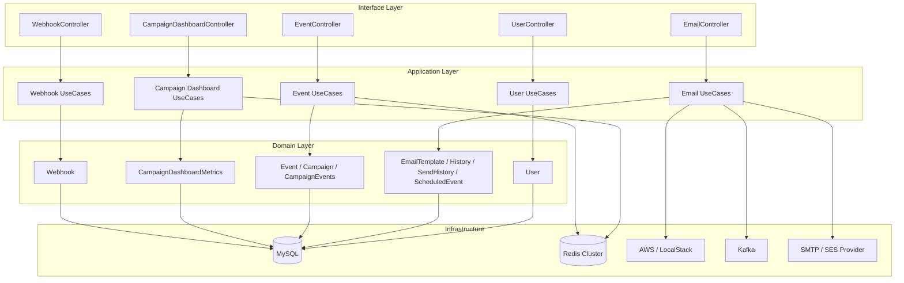
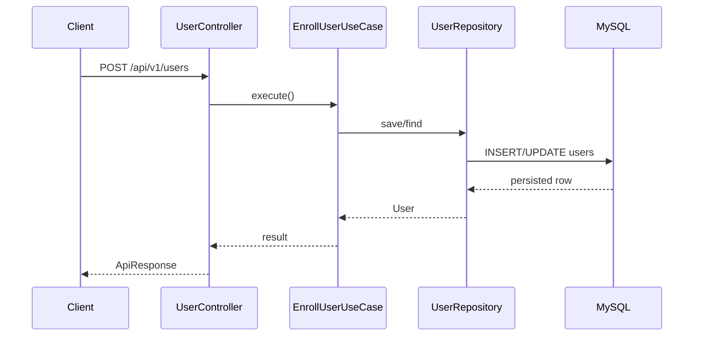
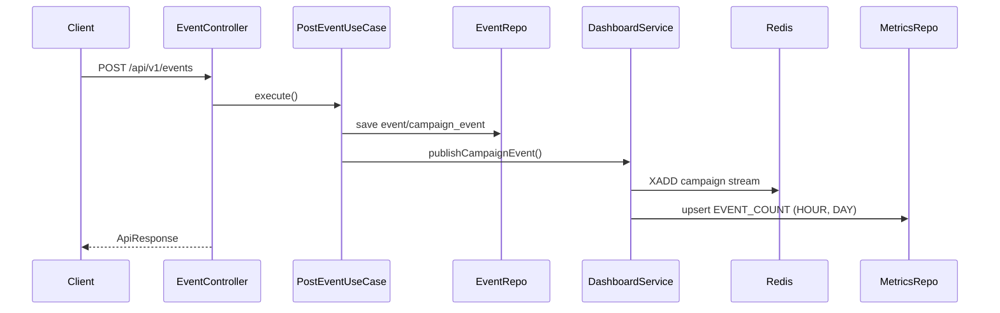
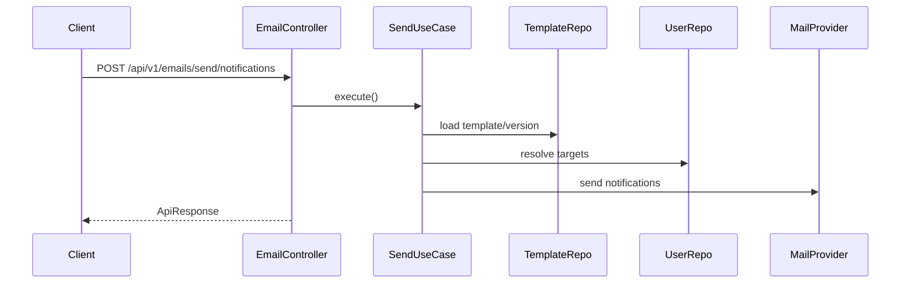
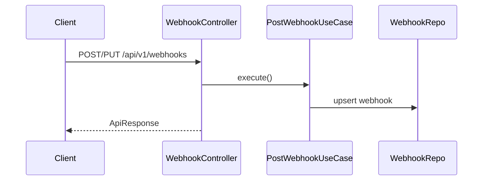

# Domain and UseCase Flows

## 문서 목적

이 문서는 `main` 브랜치 기준 구현 상태를 기준으로 CRM의 도메인 모델/유즈케이스 흐름을 정리합니다.

- 기준일: 2026-02-25
- 문서 대상: 현재 구현된 기능 + 명확히 분리된 로드맵
- 아키텍처 스타일: Clean Architecture + DDD

## 시스템 구성 요약

현재 구현 도메인

- User
- Email (Template / Send / Schedule / History)
- Event (Event/Campaign/Event Search)
- Campaign Dashboard (Metrics + SSE)
- Webhook

로드맵 도메인(미구현)

- Segment / Audience
- Journey
- Action Provider (Slack/Discord 등)
- Delivery / DeliveryAttempt 고도화

## 아키텍처 레이어

```mermaid
graph TB
    subgraph "Interface Layer"
        UC["UserController"]
        EC["EmailController"]
        EVC["EventController"]
        CDC["CampaignDashboardController"]
        WHC["WebhookController"]
    end

    subgraph "Application Layer"
        UUC["User UseCases"]
        EUC["Email UseCases"]
        EVUC["Event UseCases"]
        CDUC["Campaign Dashboard UseCases"]
        WHUC["Webhook UseCases"]
    end

    subgraph "Domain Layer"
        U["User"]
        ET["EmailTemplate / History / SendHistory / ScheduledEvent"]
        EV["Event / Campaign / CampaignEvents"]
        CDM["CampaignDashboardMetrics"]
        WH["Webhook"]
    end

    subgraph "Infrastructure"
        MYSQL[("MySQL")]
        REDIS[("Redis Cluster")]
        AWS["AWS / LocalStack"]
        KAFKA["Kafka"]
        SMTP["SMTP / SES Provider"]
    end

    UC --> UUC
    EC --> EUC
    EVC --> EVUC
    CDC --> CDUC
    WHC --> WHUC

    UUC --> U
    EUC --> ET
    EVUC --> EV
    CDUC --> CDM
    WHUC --> WH

    U --> MYSQL
    ET --> MYSQL
    EV --> MYSQL
    CDM --> MYSQL
    WH --> MYSQL

    CDUC --> REDIS
    EVUC --> REDIS
    EUC --> AWS
    EUC --> SMTP
    EUC --> KAFKA
```

## 데이터 모델(구현 기준)

### User

- 테이블: `users`
- 핵심 필드: `id`, `external_id(UK)`, `user_attributes(JSON)`, `created_at`, `updated_at`

### Email

- `email_templates`
- `email_template_histories`
- `email_send_histories`
- `scheduled_events`

### Event / Campaign

- `events`
- `campaigns` (`name` unique)
- `campaign_events` (campaign-event 매핑)

### Campaign Dashboard

- `campaign_dashboard_metrics`
- metric_type: `EVENT_COUNT`, `UNIQUE_USER_COUNT`, `TOTAL_USER_COUNT`
- time_window_unit: `MINUTE`, `HOUR`, `DAY`, `WEEK`, `MONTH`
- 현재 자동 집계는 `EVENT_COUNT`의 `HOUR`, `DAY` 중심

### Webhook

- `webhooks`
- 기능 토글: `webhook.enabled`

## API 경계(Controller 기준)

### User API

- `GET /api/v1/users`
- `POST /api/v1/users`
- `GET /api/v1/users/count`

### Email API

- `GET /api/v1/emails/templates`
- `POST /api/v1/emails/templates`
- `DELETE /api/v1/emails/templates/{templateId}`
- `POST /api/v1/emails/send/notifications`
- `GET /api/v1/emails/schedules/notifications/email`
- `POST /api/v1/emails/schedules/notifications/email`
- `DELETE /api/v1/emails/schedules/notifications/email/{scheduleId}`
- `GET /api/v1/emails/histories`

### Event API

- `POST /api/v1/events`
- `GET /api/v1/events`
- `POST /api/v1/events/campaign`

### Campaign Dashboard API

- `GET /api/v1/campaigns/{campaignId}/dashboard`
- `GET /api/v1/campaigns/{campaignId}/dashboard/stream` (SSE)
- `GET /api/v1/campaigns/{campaignId}/dashboard/summary`
- `GET /api/v1/campaigns/{campaignId}/dashboard/stream/status`

### Webhook API

- `POST /api/v1/webhooks`
- `PUT /api/v1/webhooks/{id}`
- `DELETE /api/v1/webhooks/{id}`
- `GET /api/v1/webhooks`
- `GET /api/v1/webhooks/{id}`

## 유즈케이스 플로우

### 1) 사용자 등록/갱신

```mermaid
sequenceDiagram
    participant Client
    participant UserController
    participant EnrollUserUseCase
    participant UserRepository
    participant MySQL

    Client->>UserController: POST /api/v1/users
    UserController->>EnrollUserUseCase: execute()
    EnrollUserUseCase->>UserRepository: save/find
    UserRepository->>MySQL: INSERT/UPDATE users
    MySQL-->>UserRepository: persisted row
    UserRepository-->>EnrollUserUseCase: User
    EnrollUserUseCase-->>UserController: result
    UserController-->>Client: ApiResponse
```

### 2) 이벤트 적재 + 캠페인 대시보드 반영

```mermaid
sequenceDiagram
    participant Client
    participant EventController
    participant PostEventUseCase
    participant EventRepo
    participant DashboardService
    participant Redis
    participant MetricsRepo

    Client->>EventController: POST /api/v1/events
    EventController->>PostEventUseCase: execute()
    PostEventUseCase->>EventRepo: save event/campaign_event
    PostEventUseCase->>DashboardService: publishCampaignEvent()
    DashboardService->>Redis: XADD campaign stream
    DashboardService->>MetricsRepo: upsert EVENT_COUNT (HOUR, DAY)
    EventController-->>Client: ApiResponse
```

### 3) 이메일 발송

```mermaid
sequenceDiagram
    participant Client
    participant EmailController
    participant SendUseCase
    participant TemplateRepo
    participant UserRepo
    participant MailProvider

    Client->>EmailController: POST /api/v1/emails/send/notifications
    EmailController->>SendUseCase: execute()
    SendUseCase->>TemplateRepo: load template/version
    SendUseCase->>UserRepo: resolve targets
    SendUseCase->>MailProvider: send notifications
    EmailController-->>Client: ApiResponse
```

### 4) Webhook CRUD

```mermaid
sequenceDiagram
    participant Client
    participant WebhookController
    participant PostWebhookUseCase
    participant WebhookRepo

    Client->>WebhookController: POST/PUT /api/v1/webhooks
    WebhookController->>PostWebhookUseCase: execute()
    PostWebhookUseCase->>WebhookRepo: upsert webhook
    WebhookController-->>Client: ApiResponse
```

## Idempotency 정책(현재 적용 범위)

`Idempotency-Key` 헤더는 아래 쓰기 API에서 요구됩니다.

- `POST /api/v1/users`
- `POST /api/v1/events`
- `POST /api/v1/events/campaign`
- `POST /api/v1/emails/send/notifications`
- `POST /api/v1/emails/schedules/notifications/email`
- `POST /api/v1/webhooks`
- `PUT /api/v1/webhooks/{id}`

정책 요약

- 키 형식 검증 실패: `400`
- 동일 키 + 동일 본문: 응답 재사용
- 동일 키 + 다른 본문: `409`
- 진행 중 동일 키 재요청: `409`

## 마이그레이션/배포 기준

- Flyway 마이그레이션 경로: `backend/src/main/resources/db/migration/entity`
- 최신 무결성 보강 마이그레이션: `V1.00.1.3__harden_db_integrity_constraints.sql`
- local 프로필 기준 DB: MySQL + Redis Cluster + LocalStack + Kafka

## 로드맵(미구현) 명시

아래 항목은 현재 코드베이스에 구현되지 않았으며, 별도 이슈에서 진행합니다.

- Segment/Audience 도메인 및 CRUD (`#188`)
- Campaign- Segment 타기팅 통합 (`#186`)
- 멀티채널 Action Provider (`#185`)
- Journey 자동화 엔진 (`#187`)
- RBAC/컴플라이언스 (`#190`)
- 개인정보 보존/삭제 정책 (`#198`)

해당 기능은 구현 완료 전까지 이 문서의 "구현 기준" 섹션에 포함하지 않습니다.
