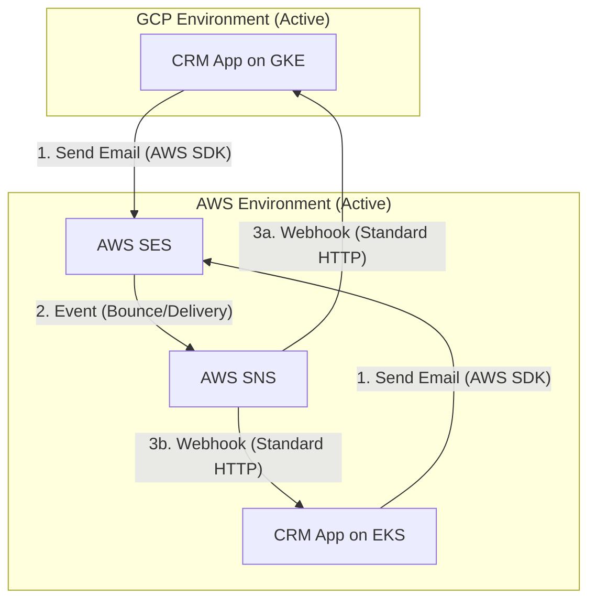
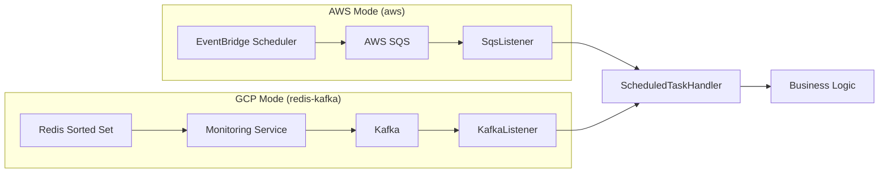

# 🌐 Multi-Cloud Agnostic Strategy (AWS + GCP)

이 문서는 CRM 프로젝트의 멀티 클라우드(Hybrid-Cloud) 대응 전략과 백엔드 애플리케이션의 클라우드 불가지론(Cloud Agnostic) 설계에 대해 설명합니다.

## 1. 핵심 아키텍처 원칙

1.  **Shared Service (Email)**: AWS SES는 모든 클라우드 환경에서 공통으로 사용하는 고정 서비스입니다.
2.  **Infrastructure Abstraction**: 메시징(SQS/Kafka), 스케줄링(EventBridge/Redis), 캐시 무효화 등은 환경 변수 설정에 따라 런타임에 구현체가 결정됩니다.
3.  **Cross-Cloud Connectivity**: AWS와 GCP는 VPN으로 연결되어 있으며, GCP의 앱은 AWS의 SES API를 직접 호출합니다.

---

## 2. 서비스 흐름도 (Service Flow)

### A. 이메일 발송 및 추적 흐름 (AWS SES 중심)

이메일은 AWS SES를 통해 발송되며, 결과 추적은 클라우드 종속성을 최소화하기 위해 **Webhook** 방식을 사용합니다.

### B. 예약 작업 흐름 (Cloud Agnostic)

설정(`SCHEDULER_PROVIDER`)에 따라 인프라가 자동으로 교체됩니다.

---

## 3. 클라우드별 배포 설정 매트릭스

동일한 애플리케이션 이미지를 사용하여 환경 변수만으로 환경을 전환합니다.

| 기능 | 환경 변수 명 | AWS (Primary) | GCP (DR) |
| :--- | :--- | :--- | :--- |
| **Scheduler** | `SCHEDULER_PROVIDER` | `aws` | `redis-kafka` |
| **Messaging** | `MESSAGE_PROVIDER` | `aws` | `kafka` |
| **Kafka** | `KAFKA_BOOTSTRAP_SERVERS` | `msk-endpoint:9092` | `gke-kafka-internal:9092` |
| **Email (SES)** | `AWS_ACCESS_KEY` | IAM Role 사용 가능 | **GCP용 IAM User Key 주입** |
| | `AWS_SECRET_KEY` | IAM Role 사용 가능 | **GCP용 IAM User Key 주입** |

---

## 4. 백엔드 구현 상세

### 1) 메시징 리스너 격리
`@SqsListener`와 `@KafkaListener`는 각자의 `Conditional` 어노테이션을 통해 활성화됩니다.
- `aws`: SQS 리스너 활성화
- `kafka`: Kafka 리스너 활성화

### 2) 공통 핸들러 패턴
인프라(SQS/Kafka)와 비즈니스 로직을 분리하기 위해 `ScheduledTaskHandler`와 `CacheInvalidationHandler`를 도입했습니다. 리스너는 메시지를 수신하여 적절한 데이터 타입으로 변환 후 핸들러에 위임합니다.

### 3) Webhook Endpoint
이메일 이벤트 추적을 위해 `/api/webhooks/ses` 엔드포인트를 제공합니다. SNS의 `SubscriptionConfirmation` 및 `Notification` 메시지를 자동으로 처리합니다.

---

## 5. 인프라 관리 (Terraform)

- **GCP 환경**: `terraform/environments/gcp/dr`에서 관리하며, AWS와 대칭되는 `app_env` 구조를 갖습니다.
- **Secret Manager**: GCP Secret Manager에 앱의 모든 환경 변수가 JSON 형태로 저장되어 컨테이너 기동 시 주입됩니다.
