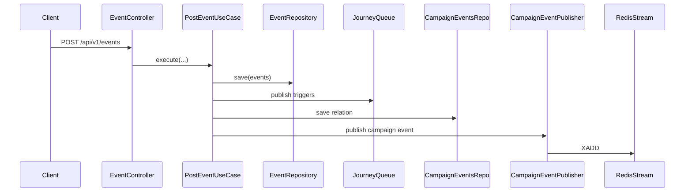

# Architecture Runtime Flows

## 1) Event 적재 → 대시보드 반영

핵심 포인트:

- 이벤트 저장 후 큐/스트림 발행이 뒤따르는 구조
- 일부 경로는 실패 허용/재시도 전략을 전제로 동작

---

## 2) Journey 운영 플로우

1. 여정 생성/수정 (`POST|PUT /api/v1/journeys`)
2. 라이프사이클 제어 (`pause/resume/archive`)
3. 실행/이력 조회 (`/executions`, `/histories`)

---

## 3) Webhook 운영 플로우

1. webhook CRUD
2. deliveries/dead-letters 조회
3. 단건/배치 retry
4. 주요 쓰기 행위 audit 기록

---

## 4) 운영 제약(현재 상태)

- Event 리소스의 Update/Delete 엔드포인트는 없음
- 스트림/큐 연계 경로는 동기 DB 트랜잭션과 완전 동일한 원자성을 보장하지 않음
- 운영 점검 시 dashboard stream 상태, dead-letter, audit 로그를 함께 확인하는 것을 권장
