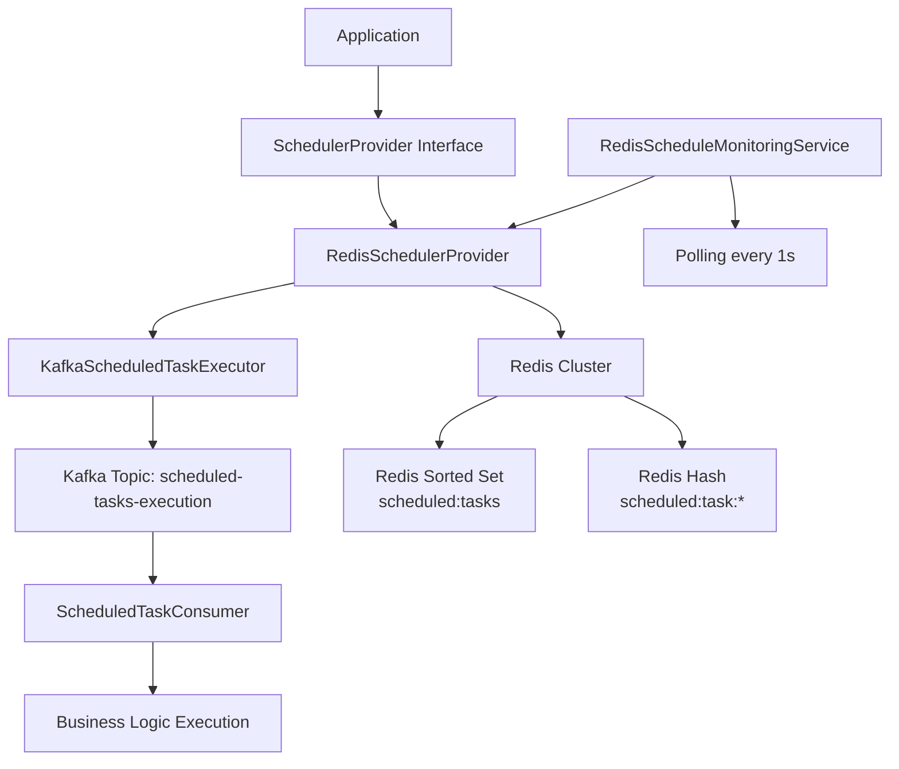

# Redis + Kafka 하이브리드 스케줄링 시스템 기술 가이드

## 개요

이 문서는 CRM 시스템에서 AWS EventBridge를 대체하기 위해 구현한 **Redis + Kafka 하이브리드 스케줄링 시스템**의 기술적 세부사항을 다룹니다. Redis는 정확한 시간 기반 스케줄링을, Kafka는 확장 가능한 이벤트 전파를 담당하는 구조입니다.

## 📋 목차

1. [시스템 아키텍처](#시스템-아키텍처)
2. [Redis 기술 상세](#redis-기술-상세)
3. [Kafka 기술 상세](#kafka-기술-상세)
4. [Spring Boot 통합](#spring-boot-통합)
5. [성능 고려사항](#성능-고려사항)
6. [모니터링 및 운영](#모니터링-및-운영)
7. [참고 자료](#참고-자료)

---

## 시스템 아키텍처

### 전체 구조



### 핵심 구성 요소

| 구성 요소 | 역할 | 기술 스택 |
|-----------|------|-----------|
| **RedisSchedulerProvider** | 스케줄 생성/조회/삭제 | Redis Sorted Set + Hash |
| **RedisScheduleMonitoringService** | 만료된 스케줄 모니터링 | Spring @Scheduled + Coroutines |
| **KafkaScheduledTaskExecutor** | 스케줄 실행 이벤트 발행 | Spring Kafka Producer |
| **ScheduledTaskConsumer** | 실행 이벤트 소비 및 처리 | Spring Kafka Consumer |

---

## Redis 기술 상세

### Redis Sorted Sets 활용

Redis Sorted Sets는 스코어(score)를 기준으로 정렬된 집합을 제공하여 시간 기반 스케줄링에 최적화되어 있습니다.

#### 핵심 개념

```bash
# Sorted Set 구조
# Key: scheduled:tasks
# Score: Unix timestamp (실행 시간)
# Member: task-id

ZADD scheduled:tasks 1704067200 "task-001"  # 2024-01-01 00:00:00 UTC
ZADD scheduled:tasks 1704070800 "task-002"  # 2024-01-01 01:00:00 UTC
```

#### 구현된 Redis 명령어들

| 명령어 | 용도 | 구현 위치 |
|--------|------|-----------|
| `ZADD` | 스케줄 추가 | `RedisSchedulerProvider.createSchedule()` |
| `ZRANGE` | 전체 스케줄 조회 | `RedisSchedulerProvider.browseSchedule()` |
| `ZRANGEBYSCORE` | 만료된 스케줄 조회 | `RedisSchedulerProvider.getExpiredSchedules()` |
| `ZREM` | 스케줄 삭제 | `RedisSchedulerProvider.deleteSchedule()` |
| `SET/GET` | 스케줄 상세 정보 저장/조회 | Task 메타데이터 관리 |

#### 데이터 구조

```kotlin
// Redis에 저장되는 스케줄 정보
data class RedisScheduledTask(
    val taskId: String,
    @JsonTypeInfo(
        use = JsonTypeInfo.Id.CLASS,
        include = JsonTypeInfo.As.PROPERTY,
        property = "@class"
    )
    val scheduleInfo: ScheduleInfo,  // 다형성 지원
    val scheduledAt: LocalDateTime,
    val createdAt: LocalDateTime
)
```

### Redis 클러스터 설정

개발 환경에서는 6개 노드로 구성된 Redis 클러스터를 사용합니다:

```yaml
# docker-compose.yml 발췌
services:
  crm-redis-node-1:
    image: redis:7-alpine
    command: redis-server --cluster-enabled yes --cluster-config-file nodes-6379.conf --port 7001 --requirepass password
    ports: ["7001:7001"]
```

#### Redis 클러스터 장점

- **고가용성**: 노드 장애 시 자동 페일오버
- **수평 확장**: 데이터 분산으로 성능 향상
- **데이터 샤딩**: 키 공간을 자동으로 분할

---

## Kafka 기술 상세

### Kafka 토픽 설계

#### scheduled-tasks-execution 토픽

```yaml
Topic: scheduled-tasks-execution
Partitions: 3
Replication Factor: 1 (개발용)
Retention: 1 day
```

#### 메시지 구조

```kotlin
data class ScheduledTaskMessage(
    val taskId: String,
    val scheduleInfo: ScheduleInfo,
    val executedAt: Long  // Unix timestamp
)
```

### Producer 설정

```kotlin
@Configuration
@ConditionalOnProperty(name = ["scheduler.provider"], havingValue = "redis-kafka")
class KafkaConfig {
    
    @Bean
    fun producerFactory(): ProducerFactory<String, Any> {
        val configProps = mapOf(
            ProducerConfig.BOOTSTRAP_SERVERS_CONFIG to bootstrapServers,
            ProducerConfig.KEY_SERIALIZER_CLASS_CONFIG to StringSerializer::class.java,
            ProducerConfig.VALUE_SERIALIZER_CLASS_CONFIG to JsonSerializer::class.java,
            ProducerConfig.ACKS_CONFIG to "all",        // 모든 복제본 확인
            ProducerConfig.RETRIES_CONFIG to 3,         // 재시도 횟수
            ProducerConfig.ENABLE_IDEMPOTENCE_CONFIG to true  // 중복 방지
        )
        return DefaultKafkaProducerFactory(configProps)
    }
}
```

### Consumer 설정

```kotlin
@KafkaListener(
    topics = [KafkaConfig.SCHEDULED_TASKS_TOPIC],
    groupId = "crm-scheduled-tasks-consumer",
    containerFactory = "kafkaListenerContainerFactory"
)
suspend fun consumeScheduledTask(
    @Payload message: ScheduledTaskMessage,
    @Header(KafkaHeaders.RECEIVED_TOPIC) topic: String,
    @Header(KafkaHeaders.RECEIVED_PARTITION) partition: Int,
    @Header(KafkaHeaders.OFFSET) offset: Long
) {
    // 비즈니스 로직 실행
    when (val scheduleInfo = message.scheduleInfo) {
        is NotificationEmailSendTimeOutEventInput -> {
            emailEventPublisher.publishNotificationEmailSendTimeOutInvokeEvent(scheduleInfo)
        }
    }
}
```

### Kafka 특징 활용

#### At-Least-Once 전달 보장

- **Producer**: `acks=all`, `enable.idempotence=true`
- **Consumer**: 수동 커밋으로 메시지 처리 완료 후 오프셋 커밋

#### 순서 보장

- 파티션 내에서는 메시지 순서 보장
- 키 기반 파티셔닝으로 관련 메시지를 동일 파티션에 배치

---

## Spring Boot 통합

### 조건부 빈 설정

```kotlin
@Component
@ConditionalOnProperty(name = ["scheduler.provider"], havingValue = "redis-kafka")
class RedisSchedulerProvider : SchedulerProvider

@Component
@ConditionalOnProperty(name = ["scheduler.provider"], havingValue = "aws")
class AwsSchedulerProvider : SchedulerProvider
```

### 설정 프로퍼티

```yaml
# application-local.yml
scheduler:
  provider: redis-kafka  # 또는 aws

spring:
  data:
    redis:
      cluster:
        nodes: localhost:7001,localhost:7002,localhost:7003,localhost:7004,localhost:7005,localhost:7006
        password: password
        max-redirects: 3
  
  kafka:
    bootstrap-servers: localhost:29092
    producer:
      acks: all
      retries: 3
      key-serializer: org.apache.kafka.common.serialization.StringSerializer
      value-serializer: org.springframework.kafka.support.serializer.JsonSerializer
    consumer:
      group-id: crm-scheduled-tasks-consumer
      key-deserializer: org.apache.kafka.common.serialization.StringDeserializer
      value-deserializer: org.springframework.kafka.support.serializer.JsonDeserializer
      properties:
        spring.json.trusted.packages: "com.manage.crm"
```

### Jackson 설정

다형성 처리를 위한 Jackson 설정:

```kotlin
@JsonTypeInfo(
    use = JsonTypeInfo.Id.CLASS,
    include = JsonTypeInfo.As.PROPERTY,
    property = "@class"
)
val scheduleInfo: ScheduleInfo
```

---

## 성능 고려사항

### Redis 성능 최적화

#### 1. 연결 풀링

```kotlin
@Bean
fun redisTemplate(): RedisTemplate<String, Any> {
    return RedisTemplate<String, Any>().apply {
        connectionFactory = jedisConnectionFactory()
        // 직렬화 설정
        keySerializer = StringRedisSerializer()
        valueSerializer = GenericJackson2JsonRedisSerializer()
    }
}

@Bean
fun jedisConnectionFactory(): JedisConnectionFactory {
    val config = JedisPoolConfig().apply {
        maxTotal = 20          // 최대 연결 수
        maxIdle = 10           // 최대 유휴 연결 수
        minIdle = 5            // 최소 유휴 연결 수
        testOnBorrow = true    // 대여 시 연결 테스트
    }
    
    return JedisConnectionFactory(redisClusterConfiguration, config)
}
```

#### 2. 배치 처리

```kotlin
// 여러 스케줄 동시 삭제
fun removeSchedulesAtomically(taskIds: List<String>): Long {
    var removedCount = 0L
    
    taskIds.forEach { taskId ->
        try {
            val removedFromZSet = redisTemplate.opsForZSet()
                .remove(SCHEDULED_TASKS_KEY, taskId)
            redisTemplate.delete("$TASK_DATA_PREFIX$taskId")
            
            if (removedFromZSet != null && removedFromZSet > 0) {
                removedCount++
            }
        } catch (ex: Exception) {
            log.warn(ex) { "Failed to remove schedule: $taskId" }
        }
    }
    
    return removedCount
}
```

### Kafka 성능 최적화

#### 1. 배치 처리

```yaml
spring:
  kafka:
    producer:
      batch-size: 16384        # 16KB 배치 크기
      linger-ms: 5             # 5ms 대기 후 전송
      compression-type: snappy # 압축 활성화
    
    consumer:
      max-poll-records: 10     # 한 번에 처리할 레코드 수
      fetch-min-size: 1024     # 최소 페치 크기
```

#### 2. 파티션 전략

- **파티션 수**: CPU 코어 수와 동일하게 설정 (3개)
- **키 기반 파티셔닝**: 관련 메시지를 동일 파티션에 배치
- **병렬 처리**: 파티션별 독립적 처리

---

## 모니터링 및 운영

### Redis 모니터링

#### 주요 메트릭

```bash
# Redis CLI를 통한 모니터링
redis-cli -c -a password

# 메모리 사용량 확인
INFO memory

# 클러스터 상태 확인
CLUSTER INFO
CLUSTER NODES

# Sorted Set 크기 확인
ZCARD scheduled:tasks

# 만료된 스케줄 수 확인
ZCOUNT scheduled:tasks -inf [현재_타임스탬프]
```

#### Redis Insight 대시보드

- **URL**: http://localhost:18081
- **주요 기능**:
  - 클러스터 노드 상태 모니터링
  - 메모리 사용량 추적
  - 키 분포 분석
  - 실시간 명령어 모니터링

### Kafka 모니터링

#### Kafka UI 대시보드

- **URL**: http://localhost:8090
- **주요 기능**:
  - 토픽별 메시지 수 모니터링
  - Consumer Lag 추적
  - 파티션 상태 확인
  - 메시지 내용 검색

#### 주요 메트릭

```bash
# 토픽 정보 확인
kafka-topics --bootstrap-server localhost:29092 --describe --topic scheduled-tasks-execution

# Consumer 그룹 상태 확인
kafka-consumer-groups --bootstrap-server localhost:29092 --describe --group crm-scheduled-tasks-consumer

# 메시지 생산/소비 확인
kafka-console-producer --bootstrap-server localhost:29092 --topic scheduled-tasks-execution
kafka-console-consumer --bootstrap-server localhost:29092 --topic scheduled-tasks-execution --from-beginning
```

### 애플리케이션 로그

```kotlin
// RedisScheduleMonitoringService 로그
@Scheduled(fixedRate = 1000)
fun processExpiredSchedules() {
    val expiredTasks = redisSchedulerProvider.getExpiredSchedules()
    
    if (expiredTasks.isNotEmpty()) {
        log.info { "Found ${expiredTasks.size} expired schedules to process" }
    }
}

// 스케줄러 상태 로깅
@Scheduled(fixedRate = 10000)
fun logSchedulerStatus() {
    val scheduleCount = redisSchedulerProvider.browseSchedule().size
    log.info { "Current scheduled tasks count: $scheduleCount" }
}
```

---

## 참고 자료

### 공식 문서

#### Redis
- **Redis 공식 문서**: https://redis.io/documentation
- **Redis Sorted Sets**: https://redis.io/docs/data-types/sorted-sets/
- **Redis Cluster**: https://redis.io/docs/reference/cluster-spec/
- **Spring Data Redis**: https://docs.spring.io/spring-data/redis/reference/

#### Kafka
- **Apache Kafka 공식 문서**: https://kafka.apache.org/documentation/
- **Spring Kafka**: https://docs.spring.io/spring-kafka/reference/
- **Kafka Producer API**: https://kafka.apache.org/documentation/#producerapi
- **Kafka Consumer API**: https://kafka.apache.org/documentation/#consumerapi

#### Spring Boot
- **Spring Boot 공식 문서**: https://docs.spring.io/spring-boot/index.html
- **Spring Boot Conditional Beans**: https://docs.spring.io/spring-boot/docs/current/reference/html/features.html#features.condition-annotations
- **Spring Task Scheduling**: https://docs.spring.io/spring-framework/reference/integration/scheduling.html

### 추가 학습 자료

#### Redis
- **Redis University**: https://university.redis.com/
- **Redis Pattern: Sorted Sets for Time Series**: https://redis.com/redis-best-practices/time-series/sorted-sets/
- **Redis Cluster 운영 가이드**: https://redis.io/docs/manual/scaling/

#### Kafka
- **Kafka: The Definitive Guide**: https://www.confluent.io/resources/kafka-the-definitive-guide/
- **Kafka Streams**: https://kafka.apache.org/documentation/streams/
- **Kafka Best Practices**: https://kafka.apache.org/documentation/#bestpractices

#### 아키텍처 패턴
- **Event Sourcing Pattern**: https://microservices.io/patterns/data/event-sourcing.html
- **CQRS Pattern**: https://docs.microsoft.com/en-us/azure/architecture/patterns/cqrs
- **Outbox Pattern**: https://microservices.io/patterns/data/transactional-outbox.html

### 관련 도구 및 라이브러리

#### Redis 관련
- **Jedis (Java Redis Client)**: https://github.com/redis/jedis
- **Lettuce (Non-blocking Redis Client)**: https://lettuce.io/
- **RedisJSON**: https://redis.io/docs/stack/json/

#### Kafka 관련
- **Kafka Connect**: https://kafka.apache.org/documentation/#connect
- **Schema Registry**: https://docs.confluent.io/platform/current/schema-registry/index.html
- **KSQL**: https://ksqldb.io/

#### 모니터링 도구
- **Prometheus + Grafana**: Redis, Kafka 메트릭 수집 및 시각화
- **Zipkin**: 분산 트레이싱
- **ELK Stack**: 로그 수집 및 분석

---

## 결론

이 Redis + Kafka 하이브리드 스케줄링 시스템은 다음과 같은 이점을 제공합니다:

1. **벤더 독립성**: 클라우드 종속성 제거
2. **확장성**: Redis 클러스터 + Kafka 파티셔닝으로 수평 확장
3. **신뢰성**: At-Least-Once 전달 보장 + 자동 페일오버
4. **관찰가능성**: 풍부한 모니터링 도구 지원
5. **비용 효율성**: 오픈소스 기반으로 운영 비용 절감

적절한 모니터링과 운영을 통해 프로덕션 환경에서 안정적으로 운영할 수 있는 시스템입니다.